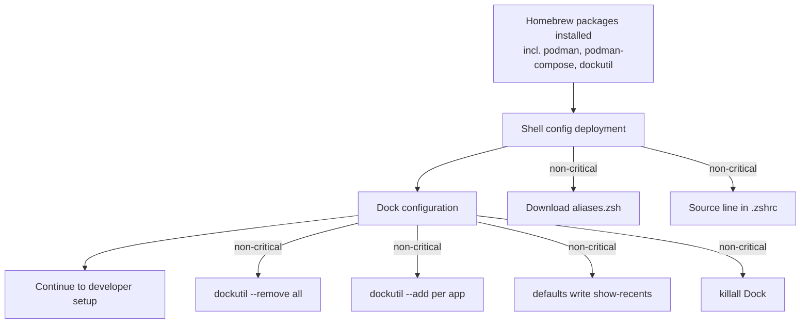

# Design — mac-env-setup

## Overview

This design extends `macos/new-mac.sh` and supporting shell configuration files to automate macOS environment setup:

1. **Dock customisation** — Replace all default Dock apps with a curated set, disable recent apps
2. **Podman container runtime** — Installed via Homebrew (already in package list), docker-compatible aliases, reference compose file
3. **Shell configuration deployment** — Deploy `aliases.zsh`, source it from `~/.zshrc`

Podman is **install-only** — the setup script does not initialise or start the Podman machine, create networks, or run containers. A reference `docker-compose.yml` is provided for users to start containers manually.

`path.zsh` is removed — pnpm PATH is handled by `brew install pnpm`, NVM is not installed, and Homebrew PATH is set via `eval "$(/opt/homebrew/bin/brew shellenv)"`.

All new sections are placed after the existing `exec > >(tee ...)` logging redirect (line 82) so output is captured in `~/SETUP.log`. All new sections are non-critical.

### Execution Order

```
Existing script (lines 1-82):
  Xcode → Homebrew → Oh-My-Zsh → Plugins → Packages → Config files → Logging init

New sections (after logging init, before developer setup):
  Shell config deployment → Dock configuration

Existing script continues (lines 83+):
  Developer setup → SSH → Git → Repos → Claude skills → Go tools → Summary
```

---

## Architecture



### Placement in new-mac.sh

New sections are inserted **after** the `exec > >(tee ...)` redirect at line 82, and **before** the dependency verification at line 86.

### Repo-only changes (no script changes)

- `macos/docker-compose.yml` — reference compose file (not deployed by script)
- `macos/aliases.zsh` — updated with Podman aliases (deployed by shell config component)
- `macos/path.zsh` — deleted

---

## Components and Interfaces

### Component 1: Shell Configuration Deployment

**Requirements:** [6.1–6.5]

Downloads `aliases.zsh` from the repository and ensures it is sourced from `~/.zshrc`.

```bash
########### SHELL CONFIGURATION ################

echo "🔧 Deploying shell configuration..."

# Download aliases.zsh (overwrite — repo-managed)
curl -fsSL -o "$HOME/.aliases.zsh" \
  https://raw.githubusercontent.com/troobit/workscripts/main/macos/aliases.zsh \
  || echo "⚠️  Could not download aliases.zsh"

# Source from .zshrc if not already present
if ! grep -q "source.*\.aliases\.zsh" "$HOME/.zshrc" 2>/dev/null; then
  echo '[ -f "$HOME/.aliases.zsh" ] && source "$HOME/.aliases.zsh"' >> "$HOME/.zshrc"
  echo "✅ Added aliases.zsh sourcing to .zshrc"
else
  echo "✅ aliases.zsh already sourced in .zshrc"
fi
```

**Key decisions:**
- `path.zsh` removed — redundant (D16). NVM not installed (D18).
- `aliases.zsh` overwritten on re-run (D15) — repo-managed, not user-edited
- Source line uses existence check (`[ -f ... ] && source`) for resilience
- Non-critical: failures logged, script continues

---

### Component 2: Dock Configuration

**Requirements:** [1.1–1.6], [2.1–2.2]

Uses `dockutil` (v3.1.3, installed via Homebrew) to clear the Dock and add the curated app list. Disables recent apps via `defaults write`. Uses two indexed arrays (bash 3.2 compatible).

```bash
########### DOCK CONFIGURATION ################

echo "🖥️  Configuring Dock..."

# Define desired Dock apps — two parallel indexed arrays (bash 3.2 compatible)
DOCK_NAMES=("Brave Browser" "WhatsApp" "iTerm" "Calendar")
DOCK_PATHS=(
  "/Applications/Brave Browser.app"
  "/Applications/WhatsApp.app"
  "/Applications/iTerm.app"
  "/System/Applications/Calendar.app"
)

if command -v dockutil &>/dev/null; then
  # Snapshot current Dock state for recovery reference
  echo "Current Dock state:"
  dockutil --list || true

  # Remove all existing Dock items (Finder preserved by macOS)
  dockutil --remove all --no-restart || echo "⚠️  dockutil remove failed"

  # Add each app in order
  for i in "${!DOCK_NAMES[@]}"; do
    app_name="${DOCK_NAMES[$i]}"
    app_path="${DOCK_PATHS[$i]}"
    if [ -d "$app_path" ]; then
      dockutil --add "$app_path" --no-restart || echo "⚠️  Could not add $app_name to Dock"
    else
      echo "⚠️  $app_name not found at $app_path — skipping Dock add"
    fi
  done

  # Disable recent apps in Dock
  defaults write com.apple.dock show-recents -bool false

  # Restart Dock to apply all changes
  killall Dock || true
  echo "✅ Dock configured"
else
  echo "⚠️  dockutil not found — skipping Dock configuration"
fi
```

**Key decisions:**
- Two indexed arrays instead of associative array — works on bash 3.2 (macOS default) (D19)
- `--no-restart` on each add/remove to batch changes; single `killall Dock` at end (D14)
- Dock state logged before modification for recovery reference
- Finder excluded from explicit add list (D10)
- App paths checked with `[ -d "$app_path" ]` before adding (req 1.4)
- Entire block guarded by `command -v dockutil` check for graceful degradation

---

### Component 3: Alias Updates

**Requirements:** [5.1–5.5]

Updates `macos/aliases.zsh` in the repository to replace Docker commands with Podman equivalents.

**Changes to `macos/aliases.zsh`:**

```bash
# Container aliases (Podman)
alias docker='podman'
alias docker-compose='podman-compose'
alias dockernuke='podman stop $(podman ps -aq) 2>/dev/null; podman rm $(podman ps -aq) 2>/dev/null; podman rmi $(podman images -q) 2>/dev/null; podman system prune -af'
alias dockerclear='podman stop $(podman ps -aq) 2>/dev/null; podman rm $(podman ps -aq) 2>/dev/null; podman rmi $(podman images -q) 2>/dev/null'
```

**Key decisions:**
- `docker` and `docker-compose` aliased to podman equivalents (D6)
- `dockernuke`/`dockerclear` use `2>/dev/null` on each subcommand to handle empty container/image lists
- Uses `;` instead of `&&` so subsequent commands run even if earlier ones fail
- `dockernuke` ends with `podman system prune -af` instead of `docker-buildx prune` (no buildx in Podman)

---

### Component 4: Reference Compose File

**Requirements:** [4.1–4.7]

A reference `macos/docker-compose.yml` for local development. This file is committed to the repo but **not deployed or executed by the setup script**. Users copy it to their project directory and run `docker-compose up` (which aliases to `podman-compose up`).

```yaml
# macos/docker-compose.yml
# Reference compose file for local development with Podman
# Copy to your project directory and run: docker-compose up
#
# Prerequisites:
#   podman machine init && podman machine start
#
# Usage:
#   cp this file to ~/repos/<project>/docker-compose.yml
#   cd ~/repos/<project>
#   docker-compose up -d

services:
  db:
    image: postgres:16-alpine
    restart: unless-stopped
    environment:
      POSTGRES_DB: ${POSTGRES_DB:-devdb}
      POSTGRES_USER: ${POSTGRES_USER:-devuser}
      POSTGRES_PASSWORD: ${POSTGRES_PASSWORD:-devpass}
    ports:
      - "${DB_PORT:-5432}:5432"
    volumes:
      - pgdata:/var/lib/postgresql/data
    networks:
      - devnet
    healthcheck:
      test: ["CMD-SHELL", "pg_isready -U ${POSTGRES_USER:-devuser}"]
      interval: 10s
      timeout: 5s
      retries: 5

  app:
    image: alpine:latest
    # Replace with your app image or build context:
    #   build: .
    #   image: your-app:latest
    depends_on:
      db:
        condition: service_healthy
    environment:
      DATABASE_URL: "postgresql://${POSTGRES_USER:-devuser}:${POSTGRES_PASSWORD:-devpass}@db:5432/${POSTGRES_DB:-devdb}"
    volumes:
      - ./src:/app/src
    ports:
      - "${APP_PORT:-8080}:8080"
    networks:
      - devnet
    # Placeholder command — replace with your app's entrypoint
    command: ["echo", "App container ready. Replace this with your entrypoint."]

volumes:
  pgdata:
    name: ${COMPOSE_PROJECT_NAME:-dev}_pgdata

networks:
  devnet:
    driver: bridge
```

**Key decisions:**
- Volume mounts use `./src` (project subdirectory) not `~/repos` — ensures separation (D22)
- Named volume `pgdata` for database persistence across container restarts
- Environment variables for all configurable values (credentials, ports) with sensible defaults
- `devnet` bridge network with DNS for container name resolution (containers reference each other by service name)
- PostgreSQL 16 Alpine (lightweight) with healthcheck
- App service is a placeholder — users replace the image and command
- Comments document prerequisites (`podman machine init/start`) and usage
- **Not deployed or executed by the setup script** (D21)

---

### Component 5: Homebrew Package List Updates

**Requirements:** [3.1–3.4], [1.1]

Adds `brave-browser`, `whatsapp`, and `dockutil` to the `default_packages` array.

**Change to line 54 of `new-mac.sh`:**

```bash
default_packages=("rename" "git" "jq" "notunes" "bluesnooze" "firefox" "gimp" "google-chrome" "iterm2" "logitech-options" "nordvpn" "raycast" "session-manager-plugin" "visual-studio-code" "wireshark" "gh" "go" "brave-browser" "whatsapp" "dockutil")
```

No other changes needed — the existing `brew install "${all_packages[@]}"` handles installation. `podman` and `podman-compose` are already in `home_packages`.

---

### File Removal: `macos/path.zsh`

**Requirements:** [6.2]

The file `macos/path.zsh` is deleted from the repository:
- **pnpm PATH**: Handled automatically by `brew install pnpm`
- **NVM initialisation**: NVM is not installed by the script (D18)
- **Homebrew PATH**: Already set by `eval "$(/opt/homebrew/bin/brew shellenv)"` at line 27
- **Hardcoded path**: Contained `/Users/ronan/Library/pnpm` which is not portable

---

## Data Models

No persistent data models. All state is checked at runtime:

| State | Check Method | Storage |
|-------|-------------|---------|
| Dock apps | `dockutil --list` | macOS plist (`com.apple.dock`) |
| Dock recents | `defaults read com.apple.dock show-recents` | macOS plist |
| Shell sourcing | `grep` in `~/.zshrc` | File content |
| Aliases | File content of `~/.aliases.zsh` | File content |

---

## Error Handling

| Section | Criticality | Strategy | Rationale |
|---------|------------|----------|-----------|
| Shell config download | Non-critical | `\|\| echo` warning | Shell works without custom aliases |
| Dock configuration | Non-critical | `\|\| true` guards, `command -v` check | Dock works with defaults if config fails |
| Alias file edits | N/A (repo change) | Committed to repo | Applied at next shell config download |
| Compose file | N/A (repo file) | Not executed by script | User runs manually |

All new script sections are non-critical and use `|| true` or `|| echo` to prevent `set -e` from aborting.

---

## Testing Strategy

### Manual Verification Script

```bash
#!/bin/bash
# verify-setup.sh — Run after new-mac.sh to verify mac-env-setup changes

PASS=0
FAIL=0

check() {
  local desc=$1; shift
  if "$@" &>/dev/null; then
    echo "✅ $desc"; PASS=$((PASS + 1))
  else
    echo "❌ $desc"; FAIL=$((FAIL + 1))
  fi
}

# Dock (req 1.2–1.6, 2.1–2.2)
check "Brave Browser in Dock" dockutil --find "Brave Browser"
check "WhatsApp in Dock" dockutil --find "WhatsApp"
check "iTerm in Dock" dockutil --find "iTerm2"
check "Calendar in Dock" dockutil --find "Calendar"
check "Recent apps disabled" test "$(defaults read com.apple.dock show-recents)" = "0"

# Homebrew packages (req 3.1–3.4)
check "brave-browser installed" brew list --cask brave-browser
check "whatsapp installed" brew list --cask whatsapp
check "dockutil installed" brew list dockutil
check "podman installed" brew list podman
check "podman-compose installed" brew list podman-compose

# Shell config (req 6.1–6.5)
check "aliases.zsh exists" test -f "$HOME/.aliases.zsh"
check "aliases.zsh sourced in zshrc" grep -q 'aliases.zsh' "$HOME/.zshrc"

# Aliases (req 5.1–5.4)
check "docker alias defined" grep -q "alias docker='podman'" "$HOME/.aliases.zsh"
check "docker-compose alias defined" grep -q "alias docker-compose='podman-compose'" "$HOME/.aliases.zsh"

# Compose file (req 4.1)
check "docker-compose.yml exists in repo" test -f "$(dirname "$0")/docker-compose.yml"

echo ""
echo "Results: $PASS passed, $FAIL failed"
```

### Idempotency Test (req 7.1)

Run `new-mac.sh` twice in succession. Second run should:
- Produce no errors
- Log "already installed/exists/configured" messages
- Result in identical Dock state and file contents

### Traceability Matrix

| Requirement | Component | Test |
|-------------|-----------|------|
| 1.1 (dockutil in packages) | C5 | `brew list dockutil` |
| 1.2 (remove all) | C2 | Dock item count after setup |
| 1.3 (add apps) | C2 | `dockutil --find` per app |
| 1.4 (verify app paths) | C2 | Remove app, re-run, check warning in log |
| 1.5 (killall Dock) | C2 | Dock restart observed |
| 1.6 (idempotent) | C2 | Run twice, diff Dock state |
| 2.1–2.2 (show-recents) | C2 | `defaults read com.apple.dock show-recents` |
| 3.1–3.4 (brew packages) | C5 | `brew list` after setup |
| 4.1–4.7 (compose file) | C4 | File exists, valid YAML |
| 5.1–5.5 (aliases) | C3 | `grep` aliases.zsh |
| 6.1–6.5 (shell config) | C1 | File existence + zshrc grep |
| 7.1–7.4 (idempotency) | All | Double-run test |
