# Design — mac-env-setup (v2)

## Overview

This design restructures `macos/new-mac.sh` into a **two-phase setup** (interactive + unattended) and extends it to provide complete macOS environment reproduction. The script now covers:

1. **Dock customisation** — Full 16-app layout with spacers, Downloads folder, and Dock preferences
2. **System preferences** — Hot corners, accent/highlight colors, Mission Control, Finder
3. **Power management** — AC/battery sleep settings via `pmset`
4. **Default browser** — Set Brave via Swift/NSWorkspace API
5. **Login items** — Auto-start apps via AppleScript
6. **Homebrew reconciliation** — Complete package lists covering all installed formulae and casks
7. **Mac App Store** — Magnet via `mas`
8. **Shell configuration** — Aliases deployment (retained from v1)
9. **Podman** — Install-only with aliases and reference compose (retained from v1)
10. **App-level settings** — iTerm2 preferences (stretch goal)

All existing developer setup sections (SSH, Git, repos, Claude skills, Go tools) are retained.

---

## Architecture

### Script Phase Structure

```
┌─────────────────────────────────────────────────┐
│              INTERACTIVE PHASE                   │
│         (user must be present)                   │
├─────────────────────────────────────────────────┤
│  1. Xcode CLI tools (may prompt install dialog)  │
│  2. Homebrew install (may prompt for password)   │
│  3. Collect user input (name, email)             │
│  4. SSH key generation + GitHub auth (gh auth)   │
│  5. sudo -v + start keep-alive background loop  │
│                                                  │
│  >>> "You can now walk away" banner <<<          │
├─────────────────────────────────────────────────┤
│              UNATTENDED PHASE                    │
│         (no further user input)                  │
├─────────────────────────────────────────────────┤
│  6. Homebrew update + install all packages       │
│  7. Mac App Store apps (mas)                     │
│  8. Nerd font + Oh-My-Zsh + plugins             │
│  9. Config file downloads                        │
│ 10. Logging initialisation                       │
│ 11. Shell config deployment                      │
│ 12. System preferences                           │
│ 13. Dock configuration + preferences             │
│ 14. Power management (uses cached sudo)          │
│ 15. Default browser                              │
│ 16. Login items                                  │
│ 17. Dependency verification                      │
│ 18. Git configuration                            │
│ 19. Repository cloning                           │
│ 20. Claude Code skills symlink                   │
│ 21. Go tool installation                         │
│ 22. App-level settings (stretch)                 │
│ 23. Kill sudo keep-alive + summary               │
└─────────────────────────────────────────────────┘
```

### Key Restructuring Change

The current script collects user input (name, email) **after** package installation (line 154). The new design moves all interactive steps — input collection, SSH key setup, and sudo credential gathering — **before** any package installation. This creates a clean boundary: the user answers a few prompts, then walks away.

### Flowchart

```mermaid
flowchart TD
    START[Start] --> XCODE[Install Xcode CLI tools]
    XCODE --> BREW_INST[Install Homebrew]
    BREW_INST --> INPUT[Collect name + email]
    INPUT --> SSH[SSH key + GitHub auth]
    SSH --> SUDO[sudo -v + keep-alive]
    SUDO --> BANNER["🚀 Unattended phase — you can walk away"]

    BANNER --> BREW_PKG[Homebrew update + install packages]
    BREW_PKG --> MAS[mas install Magnet]
    MAS --> OMZSH[Nerd font + Oh-My-Zsh + plugins]
    OMZSH --> CONFIGS[Config file downloads]
    CONFIGS --> LOG[Logging init]
    LOG --> SHELL[Shell config deployment]
    SHELL --> SYSPREFS[System preferences]
    SYSPREFS --> DOCK[Dock config + preferences]
    DOCK --> POWER[Power management]
    POWER --> DEFBROWSER[Default browser]
    DEFBROWSER --> LOGIN[Login items]
    LOGIN --> VERIFY[Dependency verification]
    VERIFY --> GIT[Git configuration]
    GIT --> REPOS[Repository cloning]
    REPOS --> CLAUDE[Claude Code skills symlink]
    CLAUDE --> GOTOOLS[Go tool installation]
    GOTOOLS --> STRETCH[App-level settings — stretch]
    STRETCH --> CLEANUP[Kill sudo keep-alive]
    CLEANUP --> SUMMARY[Summary]
```



---

## Components and Interfaces

### Component 1: Sudo Keep-Alive

**Requirements:** [6.5], [11.4]

Collects sudo credentials once during the interactive phase and maintains them throughout the unattended phase.

```bash
########### SUDO CREDENTIALS ################

echo "🔐 Requesting administrator access for system configuration..."
sudo -v

# Keep sudo alive in the background
while true; do sudo -n true; sleep 60; done 2>/dev/null &
SUDO_KEEPALIVE_PID=$!

# Trap to kill keep-alive on script exit
trap 'kill $SUDO_KEEPALIVE_PID 2>/dev/null' EXIT
```

**Placement:** End of interactive phase, just before the "walk away" banner.

**Cleanup:** `kill $SUDO_KEEPALIVE_PID` in the summary section, plus `trap EXIT` as safety net.

---

### Component 2: Homebrew Package Reconciliation

**Requirements:** [3.1]–[3.7]

Expands the package arrays to cover all currently installed formulae and casks, separated into `default_packages`, `home_packages`, and `work_packages`.

```bash
########### BREW PACKAGE LIST ################

# Formulae and casks are mixed — brew handles both transparently
default_packages=(
  # Formulae
  "bat" "fzf" "gh" "git" "htop" "jq" "rename" "tmux" "tree" "wget" "yq" "go"
  # Casks
  "bluesnooze" "brave-browser" "caffeine" "claude-code" "dockutil" "firefox"
  "gimp" "google-chrome" "iterm2" "nordvpn" "notunes" "raycast"
  "visual-studio-code" "whatsapp"
)

work_packages=(
  "slack" "microsoft-teams" "terraform"
)

home_packages=(
  # Formulae
  "awscli" "azure-cli" "cloudflared" "lychee" "mas" "nvm" "opentofu"
  "podman" "podman-compose" "uv" "ykman"
  # Casks
  "anydesk" "audacity" "bitwarden" "codelayer" "dropbox" "gcloud-cli"
  "github" "google-drive" "inkscape" "logi-options+" "postman" "spotify"
  "stremio" "tailscale-app" "transmission" "vlc" "wireshark"
  "yubico-authenticator"
)

# Combine default + home (work_packages only when explicitly selected)
all_packages=("${default_packages[@]}" "${home_packages[@]}")

echo "Installing brew packages..."
brew install "${all_packages[@]}" || echo "Could not install some packages."
```

**Key decisions:**
- `brew install` handles both formulae and casks transparently — no need for `--cask` flag
- `mas` is included in `home_packages` as a formula so it's available for Mac App Store installs
- `session-manager-plugin` and `logitech-options` retained in default_packages from v1 are superseded by the complete lists above
- `work_packages` remain opt-in, not included in `all_packages`

---

### Component 3: Mac App Store Apps

**Requirements:** [3.5]–[3.6]

Installs Mac App Store apps after Homebrew packages (which install `mas`).

```bash
########### MAC APP STORE ################

if command -v mas &>/dev/null; then
  echo "📦 Installing Mac App Store apps..."

  # Magnet (window manager) — App Store ID: 441258766
  if mas list | grep -q "441258766"; then
    echo "✅ Magnet already installed"
  else
    mas install 441258766 || echo "⚠️  Could not install Magnet — ensure App Store is signed in"
  fi
else
  echo "⚠️  mas not found — skipping Mac App Store apps"
fi
```

**Key decisions:**
- Check `mas list` for existing installs (idempotent)
- `mas` requires the user to be signed into the App Store — warn and continue if not
- Only Magnet needs `mas` — all other apps are available via Homebrew

---

### Component 4: System Preferences

**Requirements:** [5.1]–[5.6]

Applies `defaults write` commands for hot corners, colors, Mission Control, and Finder.

```bash
########### SYSTEM PREFERENCES ################

echo "⚙️  Configuring system preferences..."

# Hot corners — bottom-right: Quick Note (14)
defaults write com.apple.dock wvous-br-corner -int 14
defaults write com.apple.dock wvous-br-modifier -int 0

# Appearance — accent color: Pink (6), highlight color: Green
defaults write NSGlobalDomain AppleAccentColor -int 6
defaults write NSGlobalDomain AppleHighlightColor -string "0.752941 0.964706 0.678431 Green"

# Mission Control — group by app, don't auto-rearrange spaces
defaults write com.apple.dock expose-group-apps -bool true
defaults write com.apple.dock mru-spaces -bool false

# Finder — column view as default
defaults write com.apple.finder FXPreferredViewStyle -string "clmv"
killall Finder || true

echo "✅ System preferences configured"
```

**Key decisions:**
- Hot corner modifier `0` = no modifier key required
- `killall Finder` needed for Finder prefs to take effect
- Dock-related preferences (`wvous-*`, `expose-group-apps`, `mru-spaces`) take effect on next Dock restart (done in Component 5)
- `NSGlobalDomain` changes take effect on next app launch or logout — this is a known macOS limitation, documented in Known Limitations

---

### Component 5: Dock Configuration (Updated)

**Requirements:** [1.1]–[1.8], [2.1]–[2.5]

Expanded from v1 to include full 16-app layout, spacer tiles, Downloads folder, and Dock preferences. Uses three parallel indexed arrays (bash 3.2 compatible).

```bash
########### DOCK CONFIGURATION ################

echo "🖥️  Configuring Dock..."

# Define desired Dock apps — parallel indexed arrays (bash 3.2 compatible)
# "SPACER" entries in DOCK_NAMES trigger spacer tile insertion
DOCK_NAMES=(
  "iTerm" "Notes" "SPACER"
  "WhatsApp" "SPACER"
  "Transmission" "VLC" "Calendar" "System Settings"
  "Stremio" "TV" "Brave Browser" "iPhone Mirroring"
  "Audacity" "Visual Studio Code" "Simulator"
)
DOCK_PATHS=(
  "/Applications/iTerm.app"
  "/System/Applications/Notes.app"
  ""
  "/Applications/WhatsApp.app"
  ""
  "/Applications/Transmission.app"
  "/Applications/VLC.app"
  "/System/Applications/Calendar.app"
  "/System/Applications/System Settings.app"
  "/Applications/Stremio.app"
  "/System/Applications/TV.app"
  "/Applications/Brave Browser.app"
  "/System/Applications/iPhone Mirroring.app"
  "/Applications/Audacity.app"
  "/Applications/Visual Studio Code.app"
  "/Applications/Xcode.app/Contents/Developer/Applications/Simulator.app"
)

if command -v dockutil &>/dev/null; then
  # Snapshot current Dock state
  echo "Current Dock state:"
  dockutil --list || true

  # Remove all existing Dock items (Finder preserved by macOS)
  dockutil --remove all --no-restart || echo "⚠️  dockutil remove failed"

  # Add each app/spacer in order
  for i in "${!DOCK_NAMES[@]}"; do
    app_name="${DOCK_NAMES[$i]}"
    app_path="${DOCK_PATHS[$i]}"

    if [ "$app_name" = "SPACER" ]; then
      dockutil --add '' --type spacer --section apps --no-restart \
        || echo "⚠️  Could not add spacer"
    elif [ -d "$app_path" ]; then
      dockutil --add "$app_path" --no-restart \
        || echo "⚠️  Could not add $app_name to Dock"
    else
      echo "⚠️  $app_name not found at $app_path — skipping"
    fi
  done

  # Add Downloads folder to persistent-others section
  dockutil --add "$HOME/Downloads" --section others --no-restart \
    || echo "⚠️  Could not add Downloads folder to Dock"

  # Dock preferences
  defaults write com.apple.dock show-recents -bool false
  defaults write com.apple.dock tilesize -int 44
  defaults write com.apple.dock magnification -bool true
  defaults write com.apple.dock largesize -int 128
  defaults write com.apple.dock autohide -bool true

  # Single Dock restart to apply all changes
  killall Dock || true
  echo "✅ Dock configured"
else
  echo "⚠️  dockutil not found — skipping Dock configuration"
fi
```

**Key decisions:**
- `SPACER` sentinel in `DOCK_NAMES` array simplifies the loop — single iteration adds both apps and spacers in correct order
- Empty string `""` in `DOCK_PATHS` for spacer entries (not accessed, but keeps arrays aligned)
- Dock preferences applied before `killall Dock` so a single restart picks up everything
- Downloads folder added to `others` section (right side of Dock divider)
- `--section apps` explicit for spacers to ensure they go in the apps section

---

### Component 6: Power Management

**Requirements:** [6.1]–[6.4]

Configures AC and battery sleep settings via `pmset` (requires sudo, already cached).

```bash
########### POWER MANAGEMENT ################

echo "⚡ Configuring power management..."

# AC Power — never sleep
sudo pmset -c displaysleep 0 || echo "⚠️  Could not set AC display sleep"
sudo pmset -c sleep 0 || echo "⚠️  Could not set AC system sleep"

# Battery — conservative sleep
sudo pmset -b displaysleep 10 || echo "⚠️  Could not set battery display sleep"
sudo pmset -b sleep 1 || echo "⚠️  Could not set battery system sleep"

echo "✅ Power management configured"
```

**Key decisions:**
- Uses cached sudo from keep-alive (Component 1)
- Only sets the 4 values that differ from macOS defaults — does not touch other pmset values
- Each command has individual `|| echo` guard for granular error reporting

---

### Component 7: Default Browser

**Requirements:** [4.1]–[4.4]

Sets Brave Browser as default using Swift/NSWorkspace API (macOS 12+). Uses AppleScript to dismiss the system confirmation dialog.

```bash
########### DEFAULT BROWSER ################

echo "🌐 Setting default browser..."

if [ -d "/Applications/Brave Browser.app" ]; then
  # Start AppleScript to auto-dismiss the confirmation dialog
  osascript <<'APPLESCRIPT' &
    tell application "System Events"
      repeat 30 times
        try
          tell process "CoreServicesUIAgent"
            click button 2 of window 1
          end tell
          exit repeat
        end try
        delay 0.5
      end repeat
    end tell
APPLESCRIPT
  DIALOG_PID=$!

  # Set default browser via NSWorkspace API (macOS 12+)
  swift << 'SWIFT' || echo "⚠️  Could not set default browser"
    import AppKit
    let ws = NSWorkspace.shared
    guard let url = ws.urlForApplication(withBundleIdentifier: "com.brave.Browser") else {
      fputs("Brave Browser not found\n", stderr)
      exit(1)
    }
    let sem = DispatchSemaphore(value: 0)
    var exitCode: Int32 = 0
    ws.setDefaultApplication(at: url, toOpenURLsWithScheme: "http") { error in
      if let error = error { fputs("http: \(error)\n", stderr); exitCode = 1 }
      ws.setDefaultApplication(at: url, toOpenURLsWithScheme: "https") { error in
        if let error = error { fputs("https: \(error)\n", stderr); exitCode = 1 }
        sem.signal()
      }
    }
    sem.wait()
    exit(exitCode)
SWIFT

  # Clean up dialog handler
  kill "$DIALOG_PID" 2>/dev/null
  wait "$DIALOG_PID" 2>/dev/null

  echo "✅ Default browser set to Brave"
else
  echo "⚠️  Brave Browser not installed — skipping default browser"
fi
```

**Key decisions:**
- Swift heredoc uses NSWorkspace API available on macOS 12+ (current minimum is macOS 15 Sequoia)
- Sets both `http` and `https` schemes
- AppleScript runs in background to catch the dialog whenever it appears
- `button 2` = "Use Brave Browser" button on the confirmation dialog (button numbering may need validation)
- 30 attempts × 0.5s = 15s timeout for dialog to appear
- Falls back gracefully if Swift compilation fails or Brave isn't installed
- No additional Homebrew dependency required — `swift` is available after Xcode CLI tools

---

### Component 8: Login Items

**Requirements:** [7.1]–[7.4]

Adds utility apps to macOS login items via AppleScript.

```bash
########### LOGIN ITEMS ################

echo "🔑 Configuring login items..."

LOGIN_APPS=(
  "/Applications/Caffeine.app"
  "/Applications/noTunes.app"
  "/Applications/Magnet.app"
  "/Applications/Bluesnooze.app"
  "/Applications/Google Drive.app"
  "/Applications/Raycast.app"
)

# Get current login items
CURRENT_LOGIN_ITEMS=$(osascript -e 'tell application "System Events" to get the name of every login item' 2>/dev/null || echo "")

for app_path in "${LOGIN_APPS[@]}"; do
  app_name=$(basename "$app_path" .app)

  if [ ! -d "$app_path" ]; then
    echo "⚠️  $app_name not installed — skipping login item"
    continue
  fi

  if echo "$CURRENT_LOGIN_ITEMS" | grep -qi "$app_name"; then
    echo "✅ $app_name already a login item"
  else
    osascript -e "tell application \"System Events\" to make login item at end with properties {path:\"$app_path\", hidden:false}" \
      || echo "⚠️  Could not add $app_name as login item"
    echo "✅ Added $app_name as login item"
  fi
done
```

**Key decisions:**
- Queries existing login items once, then checks each app against the cached list (avoids repeated AppleScript calls)
- `basename` extracts app name for both display and login item lookup
- Case-insensitive grep (`-qi`) handles naming variations
- macOS Ventura+ may show a notification asking the user to allow items in System Settings > Login Items — this is unavoidable and documented in Known Limitations

---

### Component 9: Shell Configuration Deployment

*Retained from v1 — no changes*

**Requirements:** [10.1]–[10.4]

```bash
########### SHELL CONFIGURATION ################

echo "🔧 Deploying shell configuration..."

curl -fsSL -o "$HOME/.aliases.zsh" \
  https://raw.githubusercontent.com/troobit/workscripts/main/macos/aliases.zsh \
  || echo "⚠️  Could not download aliases.zsh"

if ! grep -q "source.*\.aliases\.zsh" "$HOME/.zshrc" 2>/dev/null; then
  echo '[ -f "$HOME/.aliases.zsh" ] && source "$HOME/.aliases.zsh"' >> "$HOME/.zshrc"
  echo "✅ Added aliases.zsh sourcing to .zshrc"
else
  echo "✅ aliases.zsh already sourced in .zshrc"
fi
```

---

### Component 10: Alias Updates

*Retained from v1 — no changes to `macos/aliases.zsh`*

**Requirements:** [9.1]–[9.4]

---

### Component 11: Reference Compose File

*Retained from v1 — no changes to `macos/docker-compose.yml`*

**Requirements:** [8.1]–[8.6]

---

### Component 12: App-Level Settings (Stretch Goal)

**Requirements:** [12.1]–[12.3]

#### iTerm2 Preferences

iTerm2 supports loading preferences from a custom folder or plist file.

**Approach A — Preferences folder:**
```bash
# Export: (run manually to capture current settings)
defaults export com.googlecode.iterm2 macos/iterm2-prefs.plist

# Import: (in setup script)
if [ -f "macos/iterm2-prefs.plist" ] && [ -d "/Applications/iTerm.app" ]; then
  defaults import com.googlecode.iterm2 macos/iterm2-prefs.plist
  echo "✅ iTerm2 preferences imported"
fi
```

**Approach B — iTerm2 custom preferences folder:**
iTerm2 has a built-in feature to load preferences from a URL or folder. Set via:
```bash
defaults write com.googlecode.iterm2 PrefsCustomFolder -string "$HOME/repos/workscripts/macos"
defaults write com.googlecode.iterm2 LoadPrefsFromCustomFolder -bool true
```

**Recommendation:** Approach A (direct plist import) is simpler and doesn't require iTerm2 to be running. The plist file would be committed to the repo.

#### Documented Limitations

| App | Can automate? | Limitation |
|-----|--------------|------------|
| iTerm2 | Yes | `defaults import` works. Plist must be kept up-to-date in repo. |
| Magnet | Partial | Shortcuts stored in `com.crowdcafe.windowmagnet` plist — can export/import, but activation requires license verification. |
| VS Code | No (out of scope) | Managed by logged-in user via Settings Sync. |
| Raycast | No | Settings encrypted and tied to Raycast account. Export requires Raycast Pro. |
| NordVPN | No | Requires interactive login. Cannot automate credentials. |
| Bitwarden | No | Requires interactive login. Security-sensitive. |

---

## Data Models

No persistent data models. All state is checked at runtime:

| State | Check Method | Storage |
|-------|-------------|---------|
| Dock apps | `dockutil --list` | macOS plist (`com.apple.dock`) |
| Dock preferences | `defaults read com.apple.dock` | macOS plist |
| System preferences | `defaults read` | Various plists |
| Power settings | `pmset -g` | System configuration |
| Login items | `osascript` query | System Events |
| Default browser | LaunchServices database | `com.apple.launchservices.secure.plist` |
| Shell sourcing | `grep` in `~/.zshrc` | File content |
| Aliases | File content of `~/.aliases.zsh` | File content |

---

## Error Handling

| Section | Criticality | Strategy | Rationale |
|---------|------------|----------|-----------|
| Sudo keep-alive | Critical | `sudo -v` in interactive phase, retry prompt | Required for pmset |
| Homebrew packages | Non-critical per-package | `brew install ... \|\| echo` | Individual failures don't block others |
| Mac App Store | Non-critical | `mas install \|\| echo` | Needs App Store sign-in |
| System preferences | Non-critical | Individual `defaults write` commands | Each independent |
| Dock configuration | Non-critical | `command -v dockutil` guard, per-app `\|\| echo` | Dock works without customisation |
| Power management | Non-critical | Per-command `\|\| echo` | Sensible macOS defaults exist |
| Default browser | Non-critical | App existence check, `\|\| echo` | Safari remains default |
| Login items | Non-critical | Per-app existence check, `\|\| echo` | Apps can be added manually |
| Shell config | Non-critical | `\|\| echo` on curl | Shell works without aliases |
| App-level settings | Stretch/Non-critical | Existence checks, `\|\| echo` | Apps work with defaults |

All non-critical sections use `|| true` or `|| echo` to prevent `set -e` from aborting the script.

---

## Testing Strategy

### Updated Verification Script

`macos/verify-setup.sh` will be expanded to cover all new sections:

```bash
#!/bin/bash
# verify-setup.sh — Run after new-mac.sh to verify full environment

PASS=0; FAIL=0

check() {
  local desc=$1; shift
  if "$@" &>/dev/null; then
    echo "✅ $desc"; PASS=$((PASS + 1))
  else
    echo "❌ $desc"; FAIL=$((FAIL + 1))
  fi
}

echo "=== Dock Apps ==="
for app in "iTerm" "Notes" "WhatsApp" "Transmission" "VLC" "Calendar" \
           "System Settings" "Stremio" "TV" "Brave Browser" "iPhone Mirroring" \
           "Audacity" "Visual Studio Code" "Simulator"; do
  check "$app in Dock" dockutil --find "$app"
done

echo "=== Dock Preferences ==="
check "Show recents disabled" test "$(defaults read com.apple.dock show-recents)" = "0"
check "Tile size 44" test "$(defaults read com.apple.dock tilesize)" = "44"
check "Magnification on" test "$(defaults read com.apple.dock magnification)" = "1"
check "Large size 128" test "$(defaults read com.apple.dock largesize)" = "128"
check "Auto-hide on" test "$(defaults read com.apple.dock autohide)" = "1"

echo "=== System Preferences ==="
check "Hot corner BR: Quick Note" test "$(defaults read com.apple.dock wvous-br-corner)" = "14"
check "Accent color: Pink" test "$(defaults read NSGlobalDomain AppleAccentColor)" = "6"
check "Mission Control: group by app" test "$(defaults read com.apple.dock expose-group-apps)" = "1"
check "Mission Control: no auto-rearrange" test "$(defaults read com.apple.dock mru-spaces)" = "0"
check "Finder: column view" test "$(defaults read com.apple.finder FXPreferredViewStyle)" = "clmv"

echo "=== Power Management ==="
check "AC display sleep: never" test "$(pmset -g custom | awk '/AC Power/{found=1} found && /displaysleep/{print $2; exit}')" = "0"
check "AC system sleep: never" test "$(pmset -g custom | awk '/AC Power/{found=1} found && /^ sleep/{print $2; exit}')" = "0"
check "Battery display sleep: 10" test "$(pmset -g custom | awk '/Battery Power/{found=1} found && /displaysleep/{print $2; exit}')" = "10"

echo "=== Default Browser ==="
check "Brave is default browser" plutil -extract LSHandlers json -o - \
  ~/Library/Preferences/com.apple.LaunchServices/com.apple.launchservices.secure.plist 2>/dev/null \
  | grep -q "com.brave.Browser"

echo "=== Login Items ==="
LOGIN_ITEMS=$(osascript -e 'tell application "System Events" to get the name of every login item' 2>/dev/null)
for app in "Caffeine" "noTunes" "Magnet" "Bluesnooze" "Google Drive" "Raycast"; do
  check "$app is login item" echo "$LOGIN_ITEMS" | grep -qi "$app"
done

echo "=== Homebrew Packages (sample) ==="
check "bat installed" brew list bat
check "fzf installed" brew list fzf
check "tmux installed" brew list tmux
check "dockutil installed" brew list dockutil
check "mas installed" brew list mas

echo "=== Shell Config ==="
check "aliases.zsh exists" test -f "$HOME/.aliases.zsh"
check "aliases.zsh sourced" grep -q 'aliases.zsh' "$HOME/.zshrc"

echo ""
echo "Results: $PASS passed, $FAIL failed"
```

### Idempotency Test

Run `new-mac.sh` twice in succession. Second run should:
- Produce no errors
- Log "already installed/exists/configured" messages
- Result in identical state

### Traceability Matrix

| Requirement | Component | Verification |
|-------------|-----------|-------------|
| 1.1–1.8 (Dock apps) | C5 | `dockutil --find` per app |
| 2.1–2.5 (Dock prefs) | C5 | `defaults read com.apple.dock` |
| 3.1–3.7 (Homebrew) | C2, C3 | `brew list`, `mas list` |
| 4.1–4.4 (Default browser) | C7 | LaunchServices plist check |
| 5.1–5.6 (System prefs) | C4 | `defaults read` per domain |
| 6.1–6.5 (Power) | C1, C6 | `pmset -g custom` |
| 7.1–7.4 (Login items) | C8 | `osascript` login item query |
| 8.1–8.6 (Compose) | C11 | File existence |
| 9.1–9.4 (Aliases) | C10 | `grep` aliases.zsh |
| 10.1–10.4 (Shell config) | C9 | File + zshrc checks |
| 11.1–11.5 (Idempotency) | All | Double-run test |
| 12.1–12.3 (App settings) | C12 | Manual verification |

---

## Known Limitations

- **NSGlobalDomain changes** (accent color, highlight color) require logout or app restart to take full effect across all apps. The script applies them but the visual change may not be immediate.
- **Login items on Ventura+** may trigger a macOS notification prompting the user to review items in System Settings > General > Login Items. This is a security feature and cannot be suppressed.
- **Default browser dialog**: The AppleScript dialog dismissal relies on button positioning in `CoreServicesUIAgent` — this may need adjustment across macOS versions. The button index (`button 2`) should be validated during implementation.
- **Simulator.app** requires full Xcode (not just CLI tools). If Xcode isn't installed via the App Store, Simulator won't be available and will be skipped in the Dock.
- **`mas` authentication**: Requires prior App Store sign-in. The script cannot automate Apple ID authentication.
