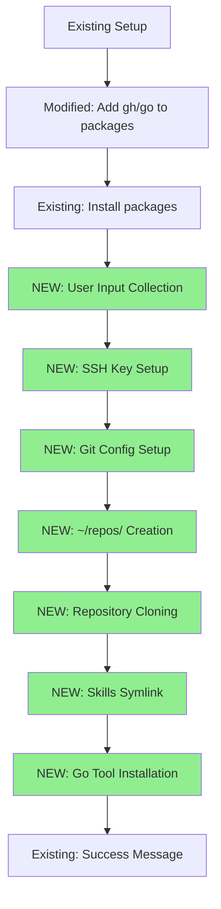
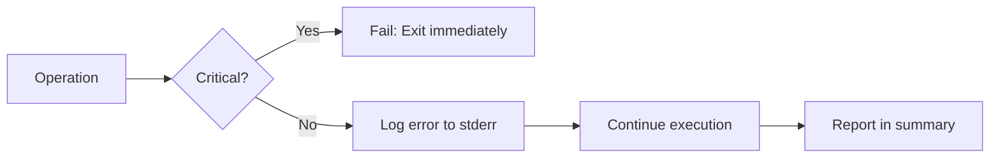
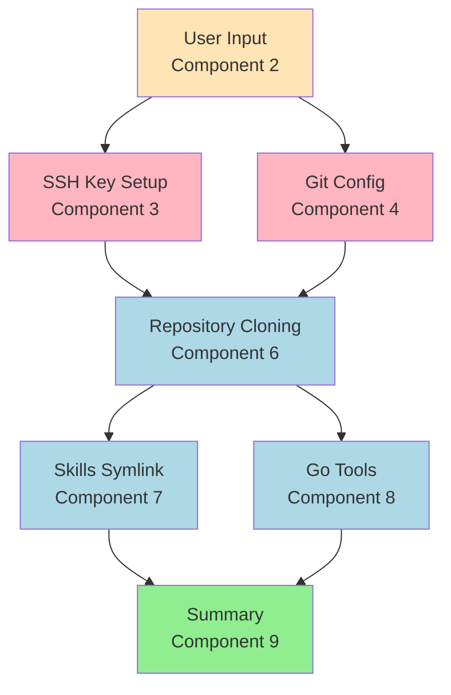
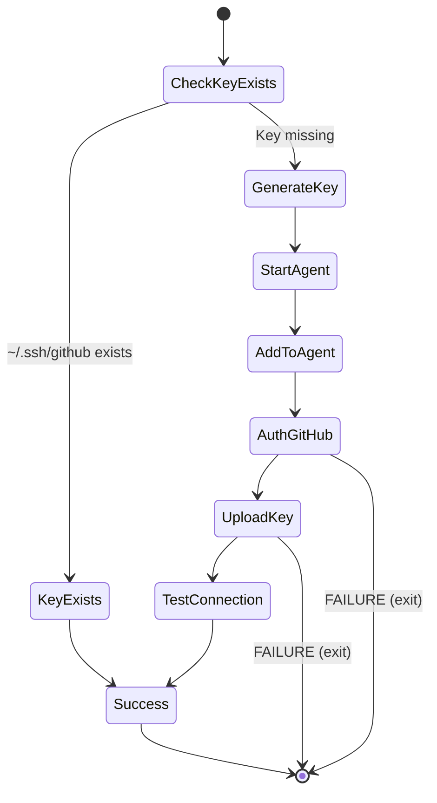

# Design Document: Repository Setup Automation

## Overview

This design extends the existing `macos/new-mac.sh` bash script to automate developer environment setup for a fresh Mac. The enhancement adds eight new functional sections that execute sequentially after the existing setup completes.

**Integration Point:** The new code integrates after line 76 (after .zshrc append) and before line 78 (final success message).

**Key Design Principles:**
- **Minimal user interaction:** Only 2 prompts (GitHub email, Git name) collected upfront, no validation overhead
- **Idempotency:** Safe to re-run; checks existing state before acting
- **Resilience:** Critical operations (SSH, gitconfig) fail-fast; non-critical (repos, tools) continue on error with detailed logging
- **Logging:** All operations logged to `~/SETUP.log` for debugging and audit trail
- **User-specific:** Hardcoded repositories and tools for this user's workflow (not general-purpose)
- **Consistency:** Follows existing script patterns (emoji logging, `|| echo` error handling, `if [ ! -x ]` checks)

---

## Architecture

### High-Level Flow



### Execution Phases

1. **Prerequisites (Existing):** Xcode tools, Homebrew, Oh-My-Zsh, packages (including new gh/go)
2. **User Input Collection:** Prompt for 2 values, validate, store in variables
3. **Authentication Setup:** Generate SSH key, authenticate with GitHub, upload key
4. **Configuration Setup:** Download and customize gitconfig template
5. **Repository Setup:** Create directory, clone 4 repositories
6. **Integration Setup:** Create Claude Code skills symlink
7. **Tool Installation:** Build and install rune and orbit Go tools
8. **Completion:** Log summary and exit

---

## Components and Interfaces

### Component 1: Package List Modification

**Purpose:** Add GitHub CLI and Go to brew package installation

**Location:** Line 54 in new-mac.sh

**Implementation:**
```bash
default_packages=("rename" "git" "jq" "notunes" "bluesnooze" "firefox" "gimp" "google-chrome" "iterm2" "logitech-options" "nordvpn" "raycast" "session-manager-plugin" "visual-studio-code" "wireshark" "gh" "go")
```

**Interface:**
- **Input:** None (modification to existing array)
- **Output:** gh and go installed via existing brew install command (line 63)
- **Error Handling:** Existing `|| echo` pattern handles installation failures

---

### Component 2: User Input Collector

**Purpose:** Collect GitHub email and Git name at start of new sections

**Location:** After line 76 (after zshrc append), before SSH key setup

**Integration Context:**
```bash
# Line 74: echo "\n# Added from troobit/workscripts setup script" >> "$HOME/.zshrc"
# Line 75: curl https://raw.githubusercontent.com/troobit/workscripts/main/macos/zshrc >> "$HOME/.zshrc"
# Line 76: fi
# >>> INSERT NEW CODE HERE <<<
# Line 78: echo "✅ Setup complete! Restart your terminal to apply all changes."
```

**Implementation:**
```bash
# Initialize setup log
echo "=== Mac Setup Log - $(date) ===" > ~/SETUP.log

echo "🚀 Setting up developer environment..." | tee -a ~/SETUP.log
echo "" | tee -a ~/SETUP.log

# Verify dependencies
echo "Checking dependencies..." | tee -a ~/SETUP.log
for cmd in gh go git; do
    if ! command -v $cmd &>/dev/null; then
        echo "❌ ERROR: $cmd not found. Please ensure brew packages installed correctly." | tee -a ~/SETUP.log
        exit 1
    fi
done
echo "✅ All dependencies available" | tee -a ~/SETUP.log
echo "" | tee -a ~/SETUP.log

# Collect user input (no validation - keep minimal)
while true; do
    read -p "Enter your GitHub email: " GITHUB_EMAIL
    if [ -n "$GITHUB_EMAIL" ]; then
        break
    fi
    echo "❌ GitHub email cannot be empty. Please try again."
done

while true; do
    read -p "Enter your name for Git commits (e.g., 'John Doe'): " GIT_NAME
    if [ -n "$GIT_NAME" ]; then
        break
    fi
    echo "❌ Git name cannot be empty. Please try again."
done

echo "✅ User input collected (email: $GITHUB_EMAIL, name: $GIT_NAME)" | tee -a ~/SETUP.log
echo "" | tee -a ~/SETUP.log
```

**Interface:**
- **Input:** User keyboard input via stdin
- **Output:**
  - `$GITHUB_EMAIL` - Used for SSH key comment and gitconfig
  - `$GIT_NAME` - Used for gitconfig
  - `~/SETUP.log` - Initialized for all subsequent logging
- **Validation:** Non-empty string only (no format validation per minimal interaction priority)
- **Error Handling:**
  - Infinite loop until non-empty input provided
  - Dependency verification exits immediately if tools missing

**Design Decisions:**
- **Collect all input upfront:** Allows unattended execution after prompts
- **No email/name validation:** Prioritizes minimal interaction over correctness (user accepts risk)
- **Dependency check upfront:** Fails fast if prerequisites missing
- **Logging to file:** All operations logged to ~/SETUP.log for debugging

---

### Component 3: SSH Key Generator and Uploader

**Purpose:** Generate ED25519 SSH key, authenticate with GitHub, upload key, verify connection

**Location:** After user input collection

**Implementation:**
```bash
# SSH Key Setup
if [ ! -f "$HOME/.ssh/github" ]; then
    echo "🔑 Generating SSH key..." | tee -a ~/SETUP.log
    ssh-keygen -t ed25519 -C "$GITHUB_EMAIL" -f "$HOME/.ssh/github" -N "" 2>&1 | tee -a ~/SETUP.log

    echo "Starting SSH agent..." | tee -a ~/SETUP.log
    eval "$(ssh-agent -s)" 2>&1 | tee -a ~/SETUP.log

    echo "Adding SSH key to agent..." | tee -a ~/SETUP.log
    ssh-add "$HOME/.ssh/github" 2>&1 | tee -a ~/SETUP.log

    echo "Authenticating with GitHub..." | tee -a ~/SETUP.log
    gh auth login --git-protocol ssh --web 2>&1 | tee -a ~/SETUP.log

    echo "Checking for existing SSH key on GitHub..." | tee -a ~/SETUP.log
    KEY_FINGERPRINT=$(ssh-keygen -lf "$HOME/.ssh/github.pub" | awk '{print $2}')
    if gh ssh-key list | grep -q "$KEY_FINGERPRINT"; then
        echo "⚠️  SSH key already uploaded to GitHub (fingerprint: $KEY_FINGERPRINT)" | tee -a ~/SETUP.log
    else
        echo "Uploading SSH key to GitHub..." | tee -a ~/SETUP.log
        gh ssh-key add "$HOME/.ssh/github.pub" --title "MacBook-$(date +%Y%m%d)" 2>&1 | tee -a ~/SETUP.log
    fi

    echo "Testing SSH connection..." | tee -a ~/SETUP.log
    ssh -T git@github.com -i "$HOME/.ssh/github" 2>&1 | tee -a ~/SETUP.log || echo "SSH test completed (expected authentication message)" | tee -a ~/SETUP.log

    echo "✅ SSH key setup complete" | tee -a ~/SETUP.log
else
    echo "✅ SSH key already exists at ~/.ssh/github" | tee -a ~/SETUP.log
fi
echo ""
```

**Interface:**
- **Input:** `$GITHUB_EMAIL` from Component 2
- **Output:**
  - `~/.ssh/github` (private key)
  - `~/.ssh/github.pub` (public key)
  - SSH key uploaded to GitHub account
- **Dependencies:** Requires `gh` (installed in Component 1)
- **Error Handling:** Critical operation - script exits on failure (set -e behavior)

**Design Decisions:**
- **ED25519 over RSA:** Modern, secure, faster
- **Empty passphrase (`-N ""`):** Enables automation without user interaction (user accepts security trade-off)
- **`gh auth login --web`:** Uses browser-based flow for secure authentication
- **Date-based key title:** Allows tracking when key was created
- **Deduplication check:** Compares fingerprint before upload to avoid duplicate key errors
- **`|| echo` on ssh test:** SSH test returns non-zero even on success (authentication message), prevent script exit
- **Comprehensive logging:** All operations logged to ~/SETUP.log including stderr output

---

### Component 4: Git Configuration Setup

**Purpose:** Create gitconfig from embedded template, customize with user input, write to ~/.gitconfig

**Location:** After SSH key setup

**Implementation:**
```bash
# Git Configuration Setup
if [ ! -f "$HOME/.gitconfig" ]; then
    echo "⚙️  Setting up Git configuration..." | tee -a ~/SETUP.log

    cat > "$HOME/.gitconfig" <<EOF
[user]
	name = "$GIT_NAME"
	email = "$GITHUB_EMAIL"

[core]
	sshCommand = ssh -i ~/.ssh/github

; include for all repositories inside \$HOME/Repos/SPECIFIC_FOLDER/
[includeIf "gitdir:~/Repos/SPECIFIC_FOLDER/"]
	path = ~/.gc/specific_config_file

; include for all repositories inside \$HOME/repos/another_specific_folder/
[includeIf "gitdir:~/repos/another_specific_folder/"]
	path = ~/.gc/another_conf_file

[push]
	autoSetupRemote = true

[pull]
	rebase = true

[init]
	defaultBranch = main

[pager]
	branch = false
	log = false

[filter "lfs"]
	clean = git-lfs clean -- %f
	smudge = git-lfs smudge -- %f
	process = git-lfs filter-process
	required = true
EOF

    echo "✅ Git configuration created" | tee -a ~/SETUP.log
else
    echo "✅ Git configuration already exists at ~/.gitconfig" | tee -a ~/SETUP.log
fi
echo ""
```

**Interface:**
- **Input:**
  - `$GIT_NAME` from Component 2
  - `$GITHUB_EMAIL` from Component 2
- **Output:** `~/.gitconfig` with personalized settings
- **Error Handling:** Critical operation - script exits on failure (set -e behavior)

**Design Decisions:**
- **Embedded template:** Removes external network dependency and integrity concerns
- **Heredoc with EOF:** Clean multi-line string generation with variable expansion
- **Direct file creation:** Simpler than mktemp + mv, atomic operation
- **Preserve template structure:** Includes conditional includes, core.sshCommand, and all other settings

---

### Component 5: Repository Directory Creator

**Purpose:** Create ~/repos/ directory if it doesn't exist

**Location:** After git configuration setup

**Implementation:**
```bash
# Create repos directory
if [ ! -d "$HOME/repos" ]; then
    echo "📁 Creating ~/repos/ directory..."
    mkdir -p "$HOME/repos"
    echo "✅ Directory created"
else
    echo "✅ Directory already exists at ~/repos/"
fi
echo ""
```

**Interface:**
- **Input:** None
- **Output:** `~/repos/` directory with default permissions (755)
- **Error Handling:** Non-critical - continues if mkdir fails

**Design Decision:** Use `mkdir -p` for parent directory creation (though not needed for ~).

---

### Component 6: Repository Cloner

**Purpose:** Clone 4 repositories via SSH into ~/repos/

**Location:** After directory creation

**Implementation:**
```bash
# Clone repositories
echo "📦 Cloning repositories..."

REPOS_CLONED=0
REPOS_TOTAL=4

clone_repo() {
    local org=$1
    local repo=$2
    local target="$HOME/repos/$repo"

    if [ -d "$target/.git" ]; then
        echo "✅ $org/$repo already cloned" | tee -a ~/SETUP.log
        REPOS_CLONED=$((REPOS_CLONED + 1))
    else
        echo "Cloning $org/$repo..." | tee -a ~/SETUP.log
        if git clone "git@github.com:$org/$repo.git" "$target" 2>&1 | tee -a ~/SETUP.log; then
            echo "✅ $org/$repo cloned successfully" | tee -a ~/SETUP.log
            REPOS_CLONED=$((REPOS_CLONED + 1))
        else
            echo "❌ Failed to clone $org/$repo (see ~/SETUP.log for details)" | tee -a ~/SETUP.log >&2
        fi
    fi
}

clone_repo "troobit" "workscripts"
clone_repo "ArjenSchwarz" "rune"
clone_repo "ArjenSchwarz" "orbit"
clone_repo "ArjenSchwarz" "agentic-coding"

echo "✅ Repository cloning complete ($REPOS_CLONED/$REPOS_TOTAL repositories available)" | tee -a ~/SETUP.log
echo ""
```

**Interface:**
- **Input:** None (hardcoded repository list)
- **Output:**
  - `~/repos/workscripts/` (troobit/workscripts)
  - `~/repos/rune/` (ArjenSchwarz/rune)
  - `~/repos/orbit/` (ArjenSchwarz/orbit)
  - `~/repos/agentic-coding/` (ArjenSchwarz/agentic-coding)
- **Dependencies:** Requires SSH key setup (Component 3)
- **Error Handling:** Non-critical - continues on clone failure, tracks success count

**Design Decisions:**
- **Helper function:** DRY principle, easier to maintain repository list
- **Check .git subdirectory:** Validates existing directory is actually a git repository
- **Success counter:** Provides user visibility into partial successes/failures
- **SSH protocol:** Uses `git@github.com:org/repo.git` format per requirements
- **Individual error messages:** Each clone failure logged separately to stderr

---

### Component 7: Claude Skills Symlink Creator

**Purpose:** Create symlink from ~/.claude/skills to ~/repos/agentic-coding/claude/skills

**Location:** After repository cloning

**Implementation:**
```bash
# Create Claude Code skills symlink
if [ -d "$HOME/repos/agentic-coding/claude/skills" ]; then
    echo "🔗 Setting up Claude Code skills symlink..."

    # Create ~/.claude directory if needed
    mkdir -p "$HOME/.claude"

    TARGET="$HOME/repos/agentic-coding/claude/skills"
    LINK="$HOME/.claude/skills"

    if [ -L "$LINK" ]; then
        # Symlink exists - check if it points to correct location
        CURRENT_TARGET=$(readlink "$LINK")
        if [ "$CURRENT_TARGET" = "$TARGET" ]; then
            echo "✅ Symlink already points to correct location"
        else
            echo "⚠️  Warning: ~/.claude/skills points to $CURRENT_TARGET (expected $TARGET)" >&2
        fi
    elif [ -e "$LINK" ]; then
        # Something exists but is not a symlink
        echo "⚠️  Warning: ~/.claude/skills exists but is not a symlink" >&2
    else
        # Create symlink
        ln -s "$TARGET" "$LINK"
        echo "✅ Claude Code skills symlink created"
    fi
else
    echo "⚠️  Skipping symlink creation - agentic-coding repository not available" >&2
fi
echo ""
```

**Interface:**
- **Input:** None (depends on Component 6 success)
- **Output:** Symlink: `~/.claude/skills` → `~/repos/agentic-coding/claude/skills`
- **Dependencies:** Requires agentic-coding repository cloned
- **Error Handling:** Non-critical - warns if existing symlink points elsewhere

**Design Decisions:**
- **Check source exists first:** Skip if agentic-coding not cloned (dependent repo)
- **Three-state check:**
  1. Is symlink pointing correctly? → Skip
  2. Is symlink pointing elsewhere? → Warn but don't modify
  3. Is not symlink but exists? → Warn but don't modify
  4. Doesn't exist? → Create
- **mkdir -p ~/.claude:** Ensures parent directory exists
- **Warning to stderr:** Non-blocking but visible issues logged to error stream
- **`[ -L ]` before `[ -e ]`:** Test symlink-ness before existence (symlinks are also files)

---

### Component 8: Go Tool Installer

**Purpose:** Install rune and orbit Go tools using make install or go install

**Location:** After symlink creation

**Implementation:**
```bash
# Install Go tools
echo "🔧 Installing Go tools..."

TOOLS_INSTALLED=0
TOOLS_TOTAL=2

install_tool() {
    local repo_name=$1
    local repo_path="$HOME/repos/$repo_name"

    if [ ! -d "$repo_path/.git" ]; then
        echo "⚠️  Skipping $repo_name - repository not available" | tee -a ~/SETUP.log >&2
        return
    fi

    echo "Installing $repo_name..." | tee -a ~/SETUP.log

    # Use subshell for directory safety
    if (cd "$repo_path" && [ -f "Makefile" ] && make install 2>&1 | tee -a ~/SETUP.log); then
        echo "✅ $repo_name installed via make install" | tee -a ~/SETUP.log
        TOOLS_INSTALLED=$((TOOLS_INSTALLED + 1))
    elif (cd "$repo_path" && go install 2>&1 | tee -a ~/SETUP.log); then
        echo "✅ $repo_name installed via go install" | tee -a ~/SETUP.log
        TOOLS_INSTALLED=$((TOOLS_INSTALLED + 1))
    else
        echo "❌ Failed to install $repo_name (see ~/SETUP.log for details)" | tee -a ~/SETUP.log >&2
    fi
}

install_tool "rune"
install_tool "orbit"

echo "✅ Tool installation complete ($TOOLS_INSTALLED/$TOOLS_TOTAL tools installed)" | tee -a ~/SETUP.log

# Verify PATH includes ~/go/bin
if [[ ":$PATH:" != *":$HOME/go/bin:"* ]]; then
    echo "⚠️  Warning: ~/go/bin not in PATH. Add to your shell config:" | tee -a ~/SETUP.log
    echo "    export PATH=\"\$HOME/go/bin:\$PATH\"" | tee -a ~/SETUP.log
fi

# Verify tools are executable
for tool in rune orbit; do
    if command -v $tool &>/dev/null; then
        echo "✅ $tool available: $(command -v $tool)" | tee -a ~/SETUP.log
    else
        echo "⚠️  $tool not found in PATH" | tee -a ~/SETUP.log
    fi
done

echo ""
```

**Interface:**
- **Input:** None (depends on Component 6 success)
- **Output:**
  - `rune` binary installed to `$GOPATH/bin` or `/Users/<user>/go/bin`
  - `orbit` binary installed to `$GOPATH/bin` or `/Users/<user>/go/bin`
- **Dependencies:**
  - Requires Go installed (Component 1)
  - Requires rune and orbit repositories cloned (Component 6)
- **Error Handling:** Non-critical - continues on installation failure, tracks success count

**Design Decisions:**
- **Try make first, fallback to go install:** Respects repository's preferred build method
- **Subshell for directory safety:** `(cd && command)` prevents directory state corruption if cd fails
- **Log build output:** All stderr/stdout logged to ~/SETUP.log for debugging
- **Check .git exists:** Validates repository actually cloned before attempting install
- **Success counter:** User visibility into which tools installed successfully
- **Helper function:** DRY principle for two tools
- **PATH assumption:** Tools install to ~/go/bin which must be in PATH (verified post-install)

---

### Component 9: Summary Logger

**Purpose:** Update final success message to reflect new setup

**Location:** Modify line 78 in new-mac.sh

**Implementation:**
```bash
echo "" | tee -a ~/SETUP.log
echo "=== Setup Summary ===" | tee -a ~/SETUP.log
echo "Repositories: $REPOS_CLONED/$REPOS_TOTAL available" | tee -a ~/SETUP.log
echo "Go tools: $TOOLS_INSTALLED/$TOOLS_TOTAL installed" | tee -a ~/SETUP.log
echo "" | tee -a ~/SETUP.log

if [ $REPOS_CLONED -gt 0 ] || [ $TOOLS_INSTALLED -gt 0 ]; then
    echo "✅ Setup complete! Check ~/SETUP.log for details." | tee -a ~/SETUP.log
else
    echo "⚠️  Setup completed with issues. Check ~/SETUP.log for details." | tee -a ~/SETUP.log
fi

echo "Restart your terminal to apply all changes." | tee -a ~/SETUP.log
```

**Interface:**
- **Input:**
  - `$REPOS_CLONED` from Component 6
  - `$TOOLS_INSTALLED` from Component 8
- **Output:**
  - Success summary to stdout
  - Complete log at ~/SETUP.log
- **Error Handling:** None (always executes)

**Design Decision:** Different message if nothing succeeded (partial failure indication)

---

## Data Models

### User Input State

```bash
# Collected during Component 2
GITHUB_EMAIL="user@example.com"  # Used for SSH key comment and gitconfig email
GIT_NAME="John Doe"              # Used for gitconfig name
```

**Validation:** Non-empty string check

---

### Repository Tracking State

```bash
# Maintained during Component 6
REPOS_CLONED=0     # Counter: successfully cloned or already existing repos
REPOS_TOTAL=4      # Constant: total number of repositories to clone
```

---

### Tool Installation State

```bash
# Maintained during Component 8
TOOLS_INSTALLED=0  # Counter: successfully installed tools
TOOLS_TOTAL=2      # Constant: total number of tools to install
```

---

## Error Handling

### Strategy

The design implements a **tiered error handling** approach based on operation criticality:

**Critical Operations** (must succeed for setup to be useful):
- SSH key generation and upload (Component 3)
- Git configuration setup (Component 4)
- **Behavior:** Rely on `set -e` - script exits immediately on failure

**Non-Critical Operations** (partial success acceptable):
- Repository cloning (Component 6)
- Symlink creation (Component 7)
- Tool installation (Component 8)
- **Behavior:** Use `|| echo "error message" >&2` pattern, continue execution

### Error Reporting



### Error Messages

**Format:**
- Normal output: `echo "✅ Success message"` (stdout)
- Errors: `echo "❌ Error message" >&2` (stderr)
- Warnings: `echo "⚠️  Warning message" >&2` (stderr)

**Examples:**
```bash
# Critical failure (relies on set -e)
ssh-keygen -t ed25519 ... # Exits if fails

# Non-critical failure
git clone ... || echo "❌ Failed to clone org/repo" >&2
```

---

## Testing Strategy

### Manual Testing Checklist

**Fresh Mac Scenario:**
1. Run script on fresh Mac
2. Verify 2 prompts appear (email, name)
3. Verify `gh auth login` opens browser
4. Verify SSH key uploaded to GitHub
5. Verify `~/.gitconfig` created with correct name/email
6. Verify all 4 repos cloned
7. Verify `~/.claude/skills` symlink created
8. Verify rune and orbit commands available

**Idempotency Testing:**
1. Run script twice
2. Verify second run skips existing SSH key
3. Verify second run skips existing gitconfig
4. Verify second run skips existing repos
5. Verify second run skips existing symlink
6. Verify script completes successfully both times

**Failure Scenarios:**
1. **Network failure during clone:**
   - Disconnect network after SSH key setup
   - Run script
   - Verify repo clone failures logged
   - Verify script continues and completes
   - Verify summary shows 0/4 repos

2. **Invalid GitHub authentication:**
   - Cancel `gh auth login` browser prompt
   - Verify script exits with error (critical failure)

3. **Missing Go installation:**
   - Remove Go from packages list
   - Run script
   - Verify tool installation fails gracefully
   - Verify summary shows 0/2 tools

**Partial Failure Testing:**
1. Rename one repository on GitHub
2. Run script
3. Verify 3/4 repos clone successfully
4. Verify tools still attempt installation
5. Verify summary correctly shows 3/4 repos

### Validation Commands

```bash
# Verify SSH key
[ -f ~/.ssh/github ] && echo "✅ SSH key exists"
ssh -T git@github.com -i ~/.ssh/github 2>&1 | grep "successfully authenticated"

# Verify gitconfig
[ -f ~/.gitconfig ] && echo "✅ Gitconfig exists"
git config --global user.name
git config --global user.email

# Verify repos
ls -la ~/repos/ | grep -E "(workscripts|rune|orbit|agentic-coding)"

# Verify symlink
[ -L ~/.claude/skills ] && readlink ~/.claude/skills

# Verify tools
command -v rune && rune --version
command -v orbit && orbit --version
```

### Test Scenarios Not Requiring Property-Based Testing

This feature does not have characteristics that would benefit from property-based testing (PBT):
- **No complex algorithms:** Sequential bash commands, no algorithmic invariants
- **No parsers/serializers:** String replacement is simple sed substitution
- **No mathematical properties:** File operations have no mathematical invariants
- **State is external:** File system state, not in-memory data structures
- **Testing is observational:** Success measured by file existence and content checks

**Conclusion:** Example-based tests (manual checklist above) are appropriate for this feature.

---

## Dependencies

### External Tools Required

| Tool | Purpose | Installation | Version |
|------|---------|--------------|---------|
| `ssh-keygen` | Generate SSH keys | Pre-installed (macOS) | OpenSSH |
| `ssh-agent` | Manage SSH keys | Pre-installed (macOS) | OpenSSH |
| `gh` | GitHub CLI | Installed in Component 1 | Latest |
| `git` | Clone repositories | Installed in existing script | Latest |
| `go` | Build Go tools | Installed in Component 1 | Latest |
| `curl` | Download templates | Pre-installed (macOS) | Latest |
| `sed` | String replacement | Pre-installed (macOS) | BSD sed |
| `ln` | Create symlinks | Pre-installed (macOS) | BSD ln |
| `make` | Build tools (optional) | Pre-installed (Xcode tools) | GNU Make |

### Repository Dependencies

| Repository | Purpose | Used By |
|------------|---------|---------|
| troobit/workscripts | Shell scripts and configs | Reference only |
| ArjenSchwarz/rune | Go CLI tool | Component 8 |
| ArjenSchwarz/orbit | Go CLI tool | Component 8 |
| ArjenSchwarz/agentic-coding | Claude Code skills | Component 7 |

---

## Security Considerations

### SSH Key Management
- **Empty passphrase:** Trade-off between automation and security. Acceptable for development machines with disk encryption enabled.
- **Key storage:** Private key stored in `~/.ssh/github` with default permissions (600).
- **Key upload:** Uses GitHub's official `gh` CLI with web authentication flow.

### Template Download
- **Raw GitHub URL:** Template downloaded from public repository over HTTPS.
- **No validation:** Assumes troobit/workscripts repository is trusted source.
- **Risk:** If repository compromised, malicious gitconfig could be installed.
- **Mitigation:** User reviews script before running (standard practice).

### Input Validation
- **Email validation:** None - accepts any non-empty string.
- **Name validation:** None - accepts any non-empty string.
- **Risk:** User could enter invalid email or name, causing git operations to fail later.
- **Mitigation:** Git will complain about invalid email format when making commits.

---

## Performance Considerations

### Network Operations
- **Sequential cloning:** 4 repositories cloned one at a time (not parallel).
- **Estimated time:** ~30-60 seconds for all clones (depends on network speed).
- **Rationale:** Simplicity over speed; parallel cloning adds complexity.

### Tool Installation
- **Sequential builds:** 2 tools built one at a time.
- **Estimated time:** ~10-30 seconds per tool (depends on build complexity).
- **Total estimated runtime:** 2-5 minutes for entire new section (excluding existing script).

### Optimization Opportunities (Future)
- Parallel repository cloning using background jobs
- Cached template downloads (avoid re-downloading)
- Pre-compiled tool binaries (avoid building from source)

---

## Maintenance Considerations

### Adding New Repositories
To add a fifth repository, modify Component 6:
1. Increment `REPOS_TOTAL=5`
2. Add new `clone_repo "org" "repo"` call

### Adding New Go Tools
To add a third tool, modify Component 8:
1. Increment `TOOLS_TOTAL=3`
2. Add new `install_tool "tool-name"` call

### Changing Prompts
User prompts centralized in Component 2. Modify `read -p` prompts and variable names.

### Template Updates
Gitconfig template maintained at:
`https://raw.githubusercontent.com/troobit/workscripts/main/macos/gitconfig`

Update placeholders in both:
- Template file: `macos/gitconfig`
- Design document: Component 4 sed commands

---

## Diagrams

### Component Interaction Diagram



**Legend:**
- 🟡 Yellow: User interaction
- 🔴 Pink: Critical operations (fail-fast)
- 🔵 Blue: Non-critical operations (continue on error)
- 🟢 Green: Always succeeds

---

### State Machine: SSH Key Setup



---

## Traceability Matrix

Maps requirements to design components:

| Requirement | Component(s) | Implementation Notes |
|-------------|--------------|---------------------|
| 1.1 Add gh to packages | 1 | Added to line 54 array |
| 1.2 Add go to packages | 1 | Added to line 54 array |
| 2.1-2.11 SSH key setup | 3 | Full implementation in Component 3 |
| 3.1-3.9 Git config setup | 4 | Template download + sed replacement |
| 4.1-4.4 ~/repos/ creation | 5 | Simple mkdir -p |
| 5.1-5.8 Repository cloning | 6 | Helper function with counter |
| 6.1-6.8 Skills symlink | 7 | Three-state check + ln -s |
| 7.1-7.8 Go tool install | 8 | make install with go install fallback |
| 8.1-8.7 User input | 2 | While loop with validation |
| 9.1-9.8 Error handling | All | Tiered approach: critical vs non-critical |
| 10.1-10.4 macOS compat | All | Bash, BSD tools, Apple Silicon PATH |
| 11.1-11.6 Integration | All | Sequential execution after line 76 |

---

## Open Questions

None - all requirements have corresponding design components with clear implementation paths.
